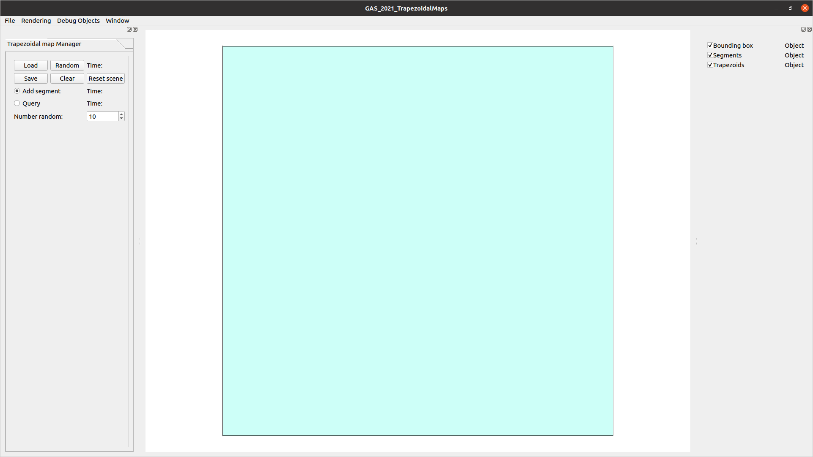
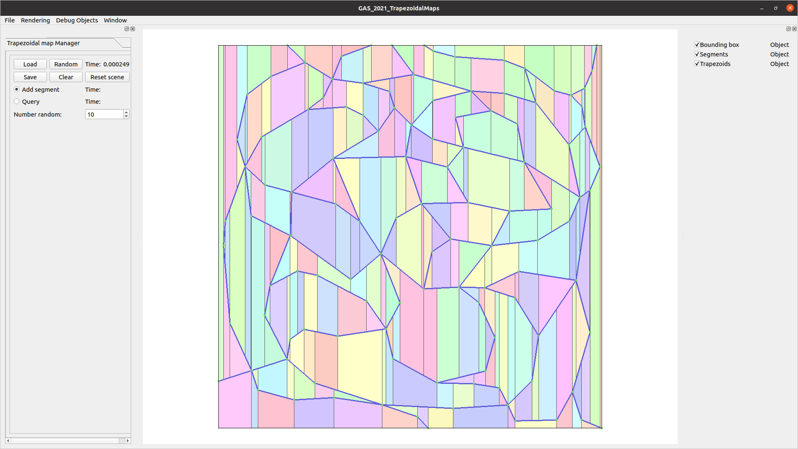
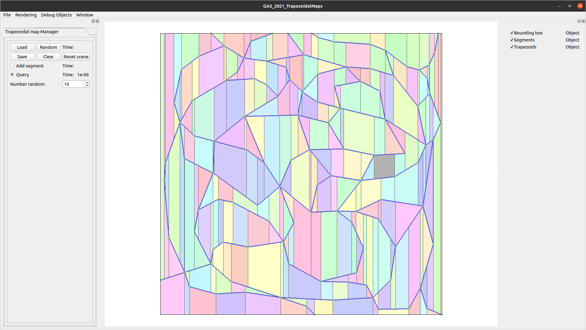
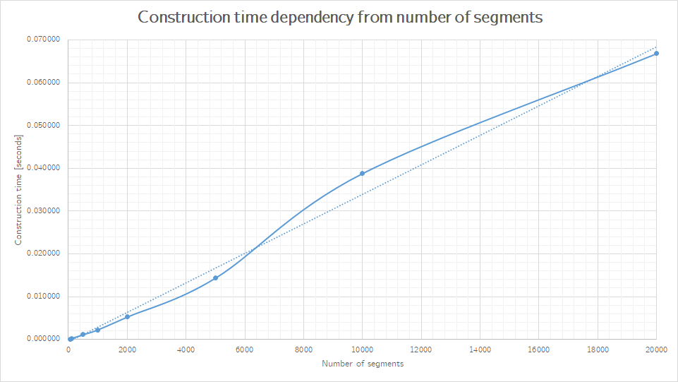

# About
This repository contains the final project of the course of *Geometric Algorithms and Spatial Data Structures*,
regarding the implementation of the algorithms and data structures needed to perform the planar point location task,
in the case of segments in general position.

This repository is available on GitHub, [here](https://github.com/UNICAAS2/as2-project-SandroGT).
This version of the project has been developed by *Sandro Gabriele Tiddia*.

# Structure
The developed algorithms and data structures, needed to perform the planar point location task, have been organized
according to the following structure:

 - **algorithms**: this folder contains the algorithms, operating on the *DAG* and *trapezoidal map* data structures,
   to perform their initialization, their construction and the query operations;
 - **data_structures**: this folder contains the various data structures used to represent the *DAG* and the
   *trapezoidal map*:
 	 - *dag_node*: these files contain the definition and implementation of the class used to represent the nodes of a
       *DAG*, allowing to store the information held by a node (ID of a point, segment or trapezoid; ID of adjacent
       nodes);
	 - *dag*:  these files contain the definition and implementation of the class used to represent the *DAG* as a
       vector of *DAG nodes*, allowing to access the nodes, replace one of them or add new ones;
	 - *trapezoid*: these files contain the definition and implementation of the class used to represent a trapezoid,
       containing an ID for its left and right points, an ID for its top and bottom segments, an ID for its four
       adjacent trapezoids (top-left, top-right, bottom-left, bottom-right) and an ID for the *DAG leaf* representing it;
	 - *trapezoidalmap*: these files contain the definition and implementation of the class used to represent a
       *trapezoidal map* as a vector of *trapezoids*, allowing to access the trapezoids, eventually modify them,
       replace one of them or add new ones;
	 - *segment_intersection_checker* and *trapezoidalmap_dataset*: part of the base project, these files handle the
       points and segments inducing the trapezoidal map;
 - **drawables**: this folder contains the drawable versions of the data structures that have to be rendered on the
   screen:
	 - *drawable_trapezoid*: these files contain the definition and implementation of the class used to represent a
       trapezoid capable of being rendered on the screen through a *draw()* method. Every drawable trapezoid
       additionally stores the coordinates of its four vertices, its color (randomly assigned) and if it has been
       selected or not;
	 - *drawable_trapezoidalmap*: these files contain the definition and implementation of the class used to represent
       a trapezoidal map capable of being rendered on the screen through a *draw()* method. Every drawable trapezoidal
       map additionally stores a vector of drawable trapezoids (shadowing the vector of trapezoids of the normal
       trapezoidal map) and the ID of the actually selected trapezoid;
	 - *drawable_trapezoidalmap_dataset*: part of the base project, these files handle the rendering of the points and
       segments inducing the trapezoidal map;
- **managers**: part of the base project, these files handle the user interface;

One of the most importance choices has been about the core data structures used to implement the *DAG* and the *trapezoidal map*:
in both cases a vector has been chosen, since there was no need to perform deletions of *trapezoids* or *DAG nodes*, and there
was no interest in their order inside the structure, allowing new insertions to be done in the back. The vector seemed the
best choice in these cases.

# Results

### Running the application
At the first launch, both the *DAG* and *trapezoidal map* are initialized with a first trapezoid representing the
bounding box, to which is assigned a random color. This is the look of the interface:

Using the *Clear* function will bring the data structures back to this configuration, without any need to restart the
application.

It is then possible to add new segments through the UI and perform the incremental steps that construct the *DAG* and
the *trapezoidal map*. This is an example of the look of the trapezoidal map after adding a set of segments defining
some closed polygons:

A randomly generated color is assigned to every new trapezoid: no grayish colors can be generated, but identical or 
very similar colors can be assigned to adjacent trapezoids. Vertical gray segments are so rendered to separate adjacent
trapezoids.

Using the query function is possible to select a trapezoid and have it highlighted in the representation with a dark
gray color. Here is an example of a selected trapezoid from the previous configuration of closed polygons:

### Stability and performance
The code seems to have no major bugs, and it has been possible to add many random segments in general position (up to
20,000) without facing any crash or visualization problem.

The time taken by the query and construction algorithms has been recorded for trapezoidal maps induced by different
numbers of segments, to give an estimate of the code performances.
The observed query times, randomly selecting a trapezoid from the trapezoidal map, range from the order of
10-6 to 10-5 seconds, regardless of the number of segments. The observed construction times are
more interesting, and they have an appreciable variation when changing the number of segments in the trapezoidal map.
The results have been summarised in the following graph and table:

Segments | Time (seconds)
---:|---:
50| 0.000097
100| 0.000214
500| 0.001103
1000| 0.002243
2000| 0.005231
5000| 0.014326
10000| 0.038763
20000| 0.066787

For the segments up to 10,000, the time values are the mean of the times observed over four random generations of
segments, while for the 20,000 segments, because of the time needed for their random generation, the time is the result
of a single random generation. All these values are just indicative of the code performance and not the results of an
appropriate evaluation test.

### Known issues
The base project (without trapezoids) allowed to see the first point selected with the mouse pointer when adding a new
segment through the UI. Once the trapezoids have been added to the application, this point became no more visible! The
problem is caused by the first point selected having a depth value higher than the trapezoids and being discarded by
the depth testing, even though the trapezoids are transparent.
